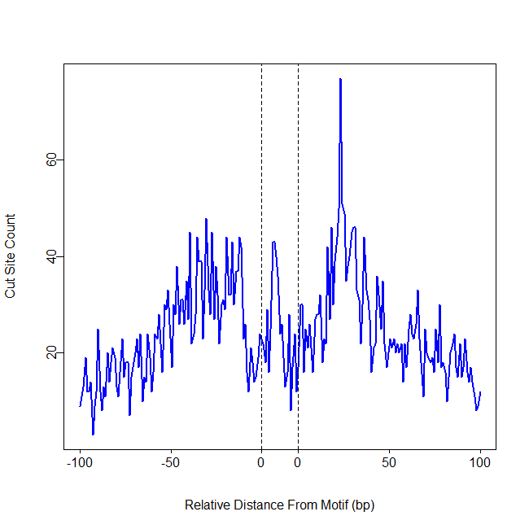

```{r setup, include=FALSE}
knitr::opts_chunk$set(echo = TRUE, warning=FALSE, message=FALSE)
```

## Introduction

The ATACpipe package provides a dataflow graphs organized pipeline 
for quantifying and annotating ATAC-seq and DNase-seq Reads in R,
which integrate the functionality of several R packages 
(such as Rsamtools, ChIPpeakAnno and so on) and external softwares 
(e.g. [AdapterRemoval](https://github.com/MikkelSchubert/adapterremoval)[1], [bowtie2](http://bowtie-bio.sourceforge.net/bowtie2/index.shtml)[2], 
through the Rowtie2 package and 
[Fseq](http://fureylab.web.unc.edu/software/fseq)[3]). 
Users can call the preset pipeline functions or 
rebuild the workflow with elements process of ATACpipe
for sequence data (FASTQ, SAM, BAM, BED file) complete/partial processing 
and analysing easily and flexibly in a single R script.
That will be convenient to migrate, share and reproduce all 
details such as parameters settings, intermediate result and so on.
Besides, a quality control report file in HTML, 
which is able to be viewed in web browser,
will be created in preset pipelines.

ATACpipe can be easily installed on various operator system platforms
(Windows, Linux, MacOs). All functions in package comsume up to 16G memery.
Most function only consume less than 8G. So the package is available for 
not only servers but also  most of PC.
ATACpipe supports analysis of both single end reads and
paired-end ATAC-seq and DNase-seq sequencing reads data.
We have successfully apply the pipeline on 
raw datasets (FASTQ files) from GEO. 
The related sequencing platform are Illumina.
All valid standard format intermediate result files
(FASTQ, SAM, BAM, BED file) generated
by other program (such as BAM BED files from ENCODE) 
are also tested by rebuilt subpipeline.

### Flowchart and overview

If you do not know where to start with ATAC-seq or DNase-seq data,
you can print flowchart like this:

```{r flowchart,message=FALSE,warning=FALSE}
library(ATACpipe)
printMap()
```

Following the flowchart, related functions could be found in mannual.


The workflow start with "UnzipAndMerge" function atacUnzipAndMerge. 
It unzips and merges the replicates into one FASTQ file(two for paired end file). Names of reads will be renamed as numbers: 1,2,3,... by calling
"Renamer" function atacRenamer. 
The file will be smaller for futher analysis. 
Adapter of reads may be found and removed by "RemoveAdapter" function 
atacRemoveAdapter. 
Then reads are ready for mapping to reference genome.
"Bowtie2Mapping" mapping function atacBowtie2Mapping can do this job. "SamToBam", "Rsortbam","BamToBed","SamToBed" and "BedUtils" provide
general processing methods for SAM file including coverting format into 
BAM or BED file, sorting according to chromosome/start site/end site,
reads conditional filtering, reads shifting and so on. 
The ready-use reads in BED file may call peak by "PeakCallingFseq" 
function atacPeakCallingFseq.
The pipeline also provide quality control elements (e.g. "FastQC", 
"LibComplexQC", "TSSQC") and some general genome function analysis elements
(e.g. "RMotifScan","RPeakAnno"). For more detail, you can see the mannual
or the examples in following sections.


### Contact

This package is developed and maintained by members of 
[Xiaowo Wang Lab](http://bioinfo.au.tsinghua.edu.cn/member/xwwang)

MOE Key Laboratory of Bioinformatics and Bioinformatics Division, 

TNLIST / Department of Automation, Tsinghua University

email:{wei-z14,w-zhang16}(at)mails.tsinghua.edu.cn

## Preparation

### Package Installation

To install the latest version of ATACpipe, you will need to be using the
latest version of R. ATACpipe is part of Bioconductor project, 
so you can install ATACpipe and its dependencies like this:

source("http://www.bioconductor.org/biocLite.R")

biocLite("ATACpipe")


### Loading

Just like other R package, 
you need to load ATACpipe like this each time before using the package.

```{r loading0,message=FALSE}
library(ATACpipe)
```
If you need to use fseq, 
we recommed to set max memory size for java (8G, 8000M in the example).
Or rJava will use the default parameter for fseq.

```{r loading1,message=FALSE}
options(java.parameters = "-Xmx8000m")
```

### Loading Recommend Package

The BSgenome package, TxDb known gene package and OrgDb annotation package
for some functions are requied. We recommend to install and
load the specific species related packages before using the packages.

```{r loadingpkg,message=FALSE}
library(magrittr)
library(BSgenome.Hsapiens.UCSC.hg19)
library(TxDb.Hsapiens.UCSC.hg19.knownGene)
library(org.Hs.eg.db)
library(R.utils)
library(magrittr)
```


### Configure Other Parameters

These configurations are also optional. 
"tmpdir" is the path to save all of the temporary data and
the default result storage path. If it is configured,
current work directory will be set as "tmpdir".
"threads" is the maximum threads allowed to 
be created for data processing.
The default value is 1.


```{r loadref, eval=TRUE}
# we use temp directiory here 
# change it to your directiory because the intermediate file may be huge
td<-tempdir()
options(atacConf=setConfigure("tmpdir",td))
options(atacConf=setConfigure("threads",8))
```

### Reference Data Installation and Loading

We strongly recommend to install referece data first before using the package
although it is optional. 
"refdir" is the folder that will save all of the reference data.
"genome" is the genome name like hg19, hg38, mm10, mm9 and so on.
The program will detect the elements that have not been installed and install them.
Some resources need to be downloaded from internet. 
So don't forget to connect internet during installation.
Or the installation will be failed.
If all of the refernce data was installed, 
these two lines still need to be called 
for configurating the reference data path and genome. 

```{r config, eval=TRUE}
#uncomment and modify to run:
#options(atacConf=setConfigure("refdir","path/to/refdatafolder"))
#options(atacConf=setConfigure("genome","hg19"))
```

The installation will consume several hours for data download,
building bowtie2 index depending on computer performance and 
network bandwidth. 

If the reference data is not configured, 
the related argument of functions has to be set manually during using. 


## Preset Pipeline

Note: The users have to configure step by step in last section to call preset pipeline.
All of the reference, temperary data storage path, max memery for rJava
and threads allowd to be created will according to the configurations.


### Case Study

For single-end case study, a fastq file of sequencing data and 
its adpater are required. The preset pipeline can be
called like this:

```{r casesingle, eval=TRUE}
bedbzfile11 <- system.file(package="ATACpipe", "extdata", "chr20_1.fq.bz2")
bedbzfile12 <- system.file(package="ATACpipe", "extdata", "chr20_2.fq.bz2")
#uncomment to run:
#atacPipe(fastqInput1 = bedbzfile11,adapter1 = "CTGTCTCTTATACACATCTCCGAGCCCACGAGACTGAAG")
```

For paired-end case study, two fastq files of sequencing data are requied. 
The preset pipeline can be called like this:

```{r casepair, eval=TRUE}
bedbzfile11 <- system.file(package="ATACpipe", "extdata", "chr20_1.fq.bz2")
bedbzfile12 <- system.file(package="ATACpipe", "extdata", "chr20_2.fq.bz2")
#uncomment to run:
#atacPipe(fastqInput1 = bedbzfile11,fastqInput2 = bedbzfile12)
```

A report of quaulity control and annalysis will be created.

[Example report](http://bioinfo.au.tsinghua.edu.cn/member/zwei/example/Report.html)

### Case-Control Study

For case-Control study, paired-end sequencing data are supported only.
Two fastq files of sequencing data for case and control each are requied.
The preset pipeline can be called like this:

```{r casecontrol, eval=TRUE}
bedbzfile11 <- system.file(package="ATACpipe", "extdata", "chr20_1.fq.bz2")
bedbzfile12 <- system.file(package="ATACpipe", "extdata", "chr20_2.fq.bz2")
bedbzfile21 <- system.file(package="ATACpipe", "extdata", "chr21_1.fq.bz2")
bedbzfile22 <- system.file(package="ATACpipe", "extdata", "chr21_2.fq.bz2")
#uncomment to run: 
#atacPipe2(case=list(fastqInput1 = bedbzfile11,fastqInput2 = bedbzfile12),
#          control=list(fastqInput1 = bedbzfile21,fastqInput2 = bedbzfile22))
```

A report of quaulity control and annalysis will be created.

[Example report](http://bioinfo.au.tsinghua.edu.cn/member/zwei/example/Report2.html)

## Build User-defined Pipeline or Use Functions Indivially

All sub-processes are available for recombine new whole pipeline or
subpipeline easily and flexibly. They are also able to be called indivially.
We just show some functions and their combinations from the package.
For detail, the users can read the manual.

### Preprocess

Users can use %>% to build a pipeline to obtain merged, renamed and
adapter removed clean reads fastq file(s) that is ready for mapping.


```{r Preprocess, warning = FALSE, results = 'hide', message = FALSE}
# Identify adapters
prefix<-system.file(package="ATACpipe", "extdata", "uzmg")
(reads_1 <-file.path(prefix,"m1",dir(file.path(prefix,"m1"))))
(reads_2 <-file.path(prefix,"m2",dir(file.path(prefix,"m2"))))

reads_merged_1 <- file.path(td,"reads1.fastq")
reads_merged_2 <- file.path(td,"reads2.fastq")
atacproc <- 
atacUnzipAndMerge(fastqInput1 = reads_1,fastqInput2 = reads_2) %>%
atacRenamer %>% atacRemoveAdapter
```
If you want to modify the parameters of AdapterRemoval,
you have to refer to Rbowtie2 package:

```{r adrmhelp}
library(Rbowtie2)
adapterremoval_usage()
```

### Mapping

If the reference has not been configured, the bowtie2 index should be built first.
Then bowtie2 mapping functions could used to map reads to reference genome.

```{r Mapping, warning = FALSE, results = 'hide', message = FALSE}
## Building a bowtie2 index
library("Rbowtie2")
refs <- dir(system.file(package="ATACpipe", "extdata", "bt2","refs"),
full=TRUE)
bowtie2_build(references=refs, bt2Index=file.path(td, "lambda_virus"),
"--threads 4 --quiet",overwrite=TRUE)
## Alignments
reads_1 <- system.file(package="ATACpipe", "extdata", "bt2", "reads",
"reads_1.fastq")
reads_2 <- system.file(package="ATACpipe", "extdata", "bt2", "reads",
"reads_2.fastq")
if(file.exists(file.path(td, "lambda_virus.1.bt2"))){
    (bowtie2Mapping(bt2Idx = file.path(td, "lambda_virus"),
       samOutput = file.path(td, "result.sam"),
       fastqInput1=reads_1,fastqInput2=reads_2,threads=3))
    head(readLines(file.path(td, "result.sam")))
}
```

If you want to modify the parameters of bowtie2,
you hava to refer to Rbowtie2 package:

```{r bt2help}
library(Rbowtie2)
bowtie2_usage()
```
### Convert SAM File to BED File

The mapping results are stored in a SAM file. 
SamToBed functions can covert it into BED file.
During coverting, the operation like sorting, shifting, filting chromosome and so on
can also be setted to do in the meantime.

```{r Convert, warning = FALSE, results = 'hide', message = FALSE}
sambzfile <- system.file(package="ATACpipe", "extdata", "Example.sam.bz2")
samfile <- file.path(td,"Example.sam")
bunzip2(sambzfile,destname=samfile,overwrite=TRUE,remove=FALSE)
samToBed(samInput = samfile) 
```

### Filtering Reads and Calling

Filter the nucleosome free reads(<100bp) for peak caling.

```{r FiltCalling, warning = FALSE, results = 'hide', message = FALSE}
bedbzfile <- system.file(package="ATACpipe", "extdata", "chr20.50000.bed.bz2")
bedfile <- file.path(td,"chr20.50000.bed")
bunzip2(bedbzfile,destname=bedfile,overwrite=TRUE,remove=FALSE)

bedUtils(bedInput = bedfile,maxFregLen = 100, chrFilterList = NULL) %>%
atacPeakCalling

```


### ATAC-seq Peak Annotation

ATAC-seq peak locate at open chromatin regions. Annotating these peak could find whether they locate at functional regions(such as promoter and enhencer). 

Function "atacPeakAnno" and "peakanno" use  function "annotatePeak" in package "ChIPseeker" to annotate ATAC-seq peak. for more information about package "ChIPseeker", [please click here](http://www.bioconductor.org/packages/release/bioc/html/ChIPseeker.html)[4].

Function "atacPeakAnno" and "peakanno" accept a bed file path as an input, users can change the parameters like "tssRegion", "TxDb" according to their require. Now, bioconductor offers many species' annotation database, [click here to search more](http://bioconductor.org/packages/release/BiocViews.html#___AnnotationData).

The following example is to exhibit how to annotate a UCSC bed file.

```{r echo = TRUE, results = 'hide', message = FALSE}
## extract example peak file from package "ATACpipe"
p1bz <- system.file("extdata", "Example_peak1.bed.bz2", package="ATACpipe")
peak1_path <- as.vector(bunzip2(filename = p1bz,
destname = file.path(getwd(), "Example_peak1.bed"),
ext="bz2", FUN=bzfile, overwrite=TRUE, remove = FALSE))
## run peakanno to annotate peaks
AnnoInfo <- peakanno(peakInput = peak1_path, TxDb = TxDb.Hsapiens.UCSC.hg19.knownGene, annoDb = "org.Hs.eg.db")
```

The output contains a pie chart in pdf format like below. It reports the percentage of peaks located in different functional regions.
```{r eval = TRUE, echo = FALSE, warning = FALSE, results = 'hide', message = FALSE}
library(ChIPseeker)
```
```{r eval = TRUE, echo = FALSE, warning = FALSE, results = 'hide', message = FALSE}
peakanno <- getReportVal(AnnoInfo, "annoOutput.rds")
plotAnnoPie(x = peakanno)
```

The function also generate a file(with suffix .df) contains annotation for all peaks. It is converted from dataframe in R, and users could open it with text editor or excel.
Below is a part of the output.
```{r eval = TRUE, echo = FALSE, warning = FALSE}
peakanno <- as.data.frame(peakanno)
colnames(peakanno)[1] <- "chromatin"
peakanno <- subset(peakanno, select=c("chromatin", "start", "end", 
                                      "annotation", "geneStart", "geneEnd", 
                                      "geneId", "distanceToTSS", "SYMBOL"))
knitr::kable(peakanno[1:5, ])
```

### Go Analysis

GO analysis is performing enrichment analysis on gene sets. It establishes the relationship between gene sets and functions, and report the most significant function to users.

Function "atacGOAnalysis" and "goanalysis" use  function "enrichGO" in package "clusterProfiler" to do GO analysis. for more information about package "clusterProfiler", [please click here](https://bioconductor.org/packages/release/bioc/html/clusterProfiler.html)[5].

The function need gene Id set as input. User could choose different GO terms(molecular function, biological process and cellular component) according to different input of parameter "ont". 

The following example is to exhibit how to do GO analisys on a gene set.

```{r eval = TRUE, echo = TRUE, results = 'hide', message = FALSE}
## extract gene ID
library(clusterProfiler)
data(geneList)
geneId <- names(geneList)[1:100]
## do GO analysis
goAna <- goanalysis(gene = geneId, OrgDb = "org.Hs.eg.db", keytype = "ENTREZID", ont = "MF")
```

The output file(suffix .df) contains the GO term sorted by p-value, below is a part of the output.

```{r eval = TRUE, echo = FALSE, warning = FALSE}
go_path <- getReportVal(goAna, "goOutput")
go_data <- read.table(file = go_path, header = TRUE, sep = "\t")
go_data <- subset(go_data, select = c("ID", "Description", "GeneRatio", "pvalue", "qvalue"))
knitr::kable(go_data[1:5, ])
```


### Motif Scan

This function search motif occurance in the given regions.

Function "atacMotifScan" and "motifscan" use  function "matchPWM" in package "Biostrings", for more parameters and usage, [click here](http://www.bioconductor.org/packages/release/bioc/html/Biostrings.html)[6].

Multi-motif is supported, and the output file is named by your input PWM list. for Multi-motif, we offer  parallel computing method for accelerating. Users could specify the parameter "n.cores" to accelerate the program.

The input motif PWM matrix is stored in a list like below.

```{r eval=TRUE, echo=TRUE, warning=FALSE}
pwm <- readRDS(system.file("extdata", "motifPWM.rds", package="ATACpipe"))

pwm
```

Using "motifscan" function to search motif in given genome regions, UCSC bed file is recommented.

```{r eval = FALSE, echo = TRUE, warning = FALSE, results = 'hide', message = FALSE}
sample.path <- system.file("extdata", "chr20_sample_peak.bed.bz2", package="ATACpipe")
sample.path <- as.vector(bunzip2(filename = sample.path,
destname = file.path(getwd(), "chr20_sample_peak.bed"),
ext="bz2", FUN=bzfile, overwrite=TRUE, remove = FALSE))
motif.data <- motifscan(peak = sample.path, genome = BSgenome.Hsapiens.UCSC.hg19,
motifPWM = pwm, prefix = "test")
```

This function reports the exact motif position in the given genome like below(motif: CTCF).

```{r eval = TRUE, echo = FALSE, warning = FALSE}
CTCF.df <- data.frame(chromatin = c("chr20", "chr20", "chr20", "chr20"),
                      start = c("189774", "239773", "247783", "281074"), 
                      end = c("189792", "239791", "247801", "281092"), 
                      strand = c("+", "+", "-", "-"),
                      score = c("0.8794931", "0.9003697", "0.9337214", "0.8511201"), 
                      sequence = c("ACTCCTCTAGAGGGTGCTC", "TTGCCACTGGGGGGAGACA",
                      "CTGCCGGCAGATGGCGGTA", "TTGCCTGCAGGGGTGGGAA"))
knitr::kable(CTCF.df)
```

### Plot Footprint

The interaction between TF and DNA would leave a "footprint" in motif position, but it is not evident in a single site, so intergrated footprint is necessary.
In addition, we only consider Tn5 cut site.
This function is based on the motif scan.

Fisrt, collecting all cut site from the bed file(Note: every line in the bed file is a DNA fagment) and save them.

```{r eval = FALSE, echo = TRUE, warning = FALSE, results = 'hide', message = FALSE}
## extract cut site position from bed file
fra_path <- system.file("extdata", "chr20.50000.bed.bz2", package="ATACpipe")
frag <- as.vector(bunzip2(filename = fra_path,
destname = file.path(getwd(), "chr20.50000.bed"),
ext="bz2", FUN=bzfile, overwrite=TRUE, remove = FALSE))
cs.data <- extractcutsite(bedInput = frag, prefix = "ATAC")
```

Next, plot footprint for different motifs. 

In the motif scan, we get a variable named "motif.data", is contains multi-motif information. In order to plot footprint of these motif in a single procedure, we will use the output of function motifscan, here is "motif.data".

```{r eval=FALSE, echo=TRUE, warning=FALSE, results='hide', message=FALSE}
fp <- atacCutSiteCount(atacProcCutSite = cs.data, atacProcMotifScan = motif.data)
```

The following is CTCF footprint using example data. 

Note: we only using a small part of the chromatin 20 as example.



## Query and Object Operations

### Workflow Map 

ATACpipe is organized in data flow graph. Except for refering manual, 
the user may print the map to know workflow order.


```{r printmap, warning=FALSE, message=FALSE}
bedbzfile <- system.file(package="ATACpipe", "extdata", "chr20.50000.bed.bz2")
bedfile <- file.path(td,"chr20.50000.bed")
bunzip2(bedbzfile,destname=bedfile,overwrite=TRUE,remove=FALSE)

peakproc <-bedUtils(bedInput = bedfile,maxFregLen = 100, chrFilterList = NULL) %>%
atacPeakCalling 

peakproc %>%  printMap

```

By printing the map, it is easy to know what valid processes are available to call next and 
what preprocess has been done before. 


### Parameters

It is easy to query the parameters set for the process with ATACProc objects.
You can query available parameters like this:
```{r qpara, warning=FALSE, message=FALSE}
#query all of available parameters
getParamItems(peakproc)
```

The value of a specific parameter can be obtain like this:
```{r getpara, warning=FALSE, message=FALSE}
#query a parameter value
getParam(peakproc,"fragmentSize")

```


### Report Value
Similarly, it is also easy to query the report value calculated by the process with ATACProc objects
```{r getReport, warning=FALSE, results='hide', message=FALSE}
sambzfile <- system.file(package="ATACpipe", "extdata", "Example.sam.bz2")
samfile <- file.path(td,"Example.sam")
bunzip2(sambzfile,destname=samfile,overwrite=TRUE,remove=FALSE)
samToBedProc<-samToBed(samInput = samfile)
```

When the ATACProc objects are obtained,
you can query all of available report items.

```{r getReport1,message=FALSE}
getReportItems(samToBedProc)
```

The value of specific report item can be get like this:
```{r getReport2,message=FALSE}
#query a parameter value
getReportVal(samToBedProc,"report")

```

### Clear the Cache and Redo Process
If the user call a process fuction that was called last time and finished, 
the process function will not redo the process. So if users need to redo the process,
they have to clear the cache like this:

```{r clearcache, warning=FALSE, results='hide', message=FALSE}
clearProcCache(peakproc)
process(peakproc)
```

## Acknowledgement

We would like to thank Huan Fang for package testing and valuable suggestions,

and Kui Hua for prividing package testing on Macbook.

## Reference

[1] Langmead, B., & Salzberg, S. L. (2012). Fast gapped-read alignment with Bowtie 2. Nature methods, 9(4), 357-359.

[2] Schubert, Lindgreen, and Orlando (2016). AdapterRemoval v2: rapid adapter trimming, identification, and read merging. BMC Research Notes, 12;9(1):88.

[3] Boyle, A. P., Guinney, J., Crawford, G. E., & Furey, T. S. (2008). F-Seq: a feature density estimator for high-throughput sequence tags. Bioinformatics, 24(21), 2537-2538.

[4] Yu G, Wang L and He Q (2015). “ChIPseeker: an R/Bioconductor package for ChIP peak annotation, comparison and visualization.” Bioinformatics, 31(14), pp. 2382-2383. doi: 10.1093/bioinformatics/btv145.

[5] Yu G, Wang L, Han Y and He Q (2012). “clusterProfiler: an R package for comparing biological themes among gene clusters.” OMICS: A Journal of Integrative Biology, 16(5), pp. 284-287. doi: 10.1089/omi.2011.0118.

[6] Pagès H, Aboyoun P, Gentleman R and DebRoy S (2017). Biostrings: String objects representing biological sequences, and matching algorithms. R package version 2.44.2.

## Session Infomation

```{r session}
sessionInfo()
```

