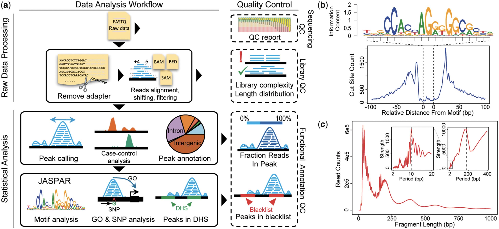

```{r setup, include=FALSE}
knitr::opts_chunk$set(echo = TRUE, warning=FALSE, message=FALSE)
```

# Starting from Scratch

+ Links:
+ [Vignettes](https://wzthu.github.io/esATAC/doc/vignettes.html)
+ More ...

# Function Overview of esATAC



# Introduction

The esATAC package provides a dataflow graphs organized end-to-end pipeline 
for quantifying and annotating ATAC-seq and DNase-seq Reads in R,
which integrate the functionality of several R packages 
(such as Rsamtools, ChIPpeakAnno and so on) and external softwares 
(e.g. [AdapterRemoval](https://github.com/MikkelSchubert/adapterremoval)[1], [bowtie2](http://bowtie-bio.sourceforge.net/bowtie2/index.shtml)[2], 
through the Rowtie2 package and 
[Fseq](http://fureylab.web.unc.edu/software/fseq)[3]). 
Users could process raw FASTQ files through preset pipeline or customize their own workflow starting from any intermediate stages easily and flexibly in a single R script.
That will be convenient to migrate, share and reproduce all 
details such as parameters settings, intermediate result and so on.
Besides, a pretty quality control report file in HTML, 
which is able to be viewed in web browser,
will be created in preset pipelines.

esATAC can be easily installed on various operator system platforms
(Windows, Linux, Mac OS). All functions in package consume up to 16G memory.
Most function only consume less than 8G. So the package is available for 
not only servers but also  most of PC.

esATAC supports analysis of both single end reads and paired-end reads ATAC-seq data generated by Illumina sequencing platform. It can directly process raw datasets (FASTQ files) from GEO.  Other standard format intermediate result files (FASTQ, SAM, BAM, BED file) generated by other programs (such as BAM BED files from ENCODE) are also tested by rebuilt sub-pipeline.

# Publication

[Wei, Z., Zhang, W., Fang, H., Li, Y., & Wang, X. (2018). esATAC: an easy-to-use systematic pipeline for ATAC-seq data analysis. Bioinformatics, 34(15), 2664-2665.](https://doi.org/10.1093/bioinformatics/bty141)

# Contact

This package is developed and maintained by members of 

[Xiaowo Wang Lab](http://bioinfo.au.tsinghua.edu.cn/member/xwwang)

Ministry of Education Key Laboratory of Bioinformatics, 

Center for Synthetic and Systems Biology, 

Department of Automation, 

Tsinghua University, Beijing, 100084, China

email:{wei-z14,w-zhang16}(at)mails.tsinghua.edu.cn


# Reference

[1] Langmead, B., & Salzberg, S. L. (2012). Fast gapped-read alignment with Bowtie 2. Nature methods, 9(4), 357-359.

[2] Schubert, Lindgreen, and Orlando (2016). AdapterRemoval v2: rapid adapter trimming, identification, and read merging. BMC Research Notes, 12;9(1):88.

[3] Boyle, A. P., Guinney, J., Crawford, G. E., & Furey, T. S. (2008). F-Seq: a feature density estimator for high-throughput sequence tags. Bioinformatics, 24(21), 2537-2538.

