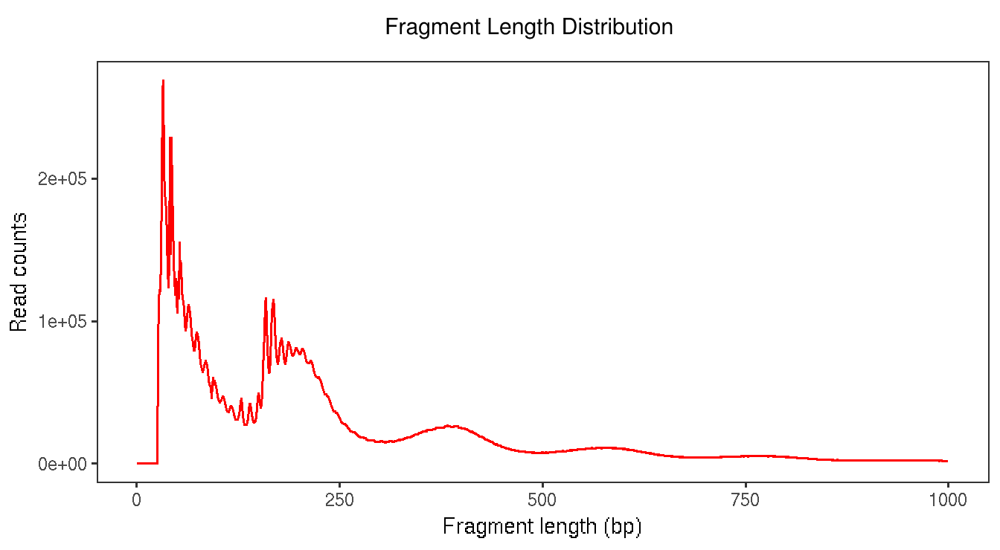

```{r setup, include=FALSE}
knitr::opts_chunk$set(echo = TRUE, warning=FALSE, message=FALSE)
```

# Introduction

The esATAC package provides a dataflow graphs organized end-to-end pipeline 
for quantifying and annotating ATAC-seq and DNase-seq Reads in R,
which integrate the functionality of several R packages 
(such as Rsamtools, ChIPpeakAnno and so on) and external softwares 
(e.g. [AdapterRemoval](https://github.com/MikkelSchubert/adapterremoval)[1], [bowtie2](http://bowtie-bio.sourceforge.net/bowtie2/index.shtml)[2], 
through the Rowtie2 package and 
[Fseq](http://fureylab.web.unc.edu/software/fseq)[3]). 
Users could process raw FASTQ files through preset pipeline or customize their own workflow starting from any intermediate stages easily and flexibly in a single R script.
That will be convenient to migrate, share and reproduce all 
details such as parameters settings, intermediate result and so on.
Besides, a pretty quality control report file in HTML, 
which is able to be viewed in web browser,
will be created in preset pipelines.

esATAC can be easily installed on various operator system platforms
(Windows, Linux, Mac OS). All functions in package consume up to 16G memory.
Most function only consume less than 8G. So the package is available for 
not only servers but also  most of PC.

esATAC supports analysis of both single end reads and paired-end reads ATAC-seq data generated by Illumina sequencing platform. It can directly process raw datasets (FASTQ files) from GEO.  Other standard format intermediate result files (FASTQ, SAM, BAM, BED file) generated by other programs (such as BAM BED files from ENCODE) are also tested by rebuilt sub-pipeline.

## Flowchart and overview

If you do not know where to start with ATAC-seq or DNase-seq data,
you can print flowchart like this:

```{r flowchart,message=FALSE,warning=FALSE}
library(esATAC)
printMap()
```

Following the flowchart, related functions could be found in manual.
For example,if you want to query functions related to "SamToBed" in the flowchart, 
you can query "SamToBed" directly like this:

```{r querymannual0,message=FALSE,warning=FALSE}
?SamToBed
```

If you know exactly function name, you can add "atac" prefix to query mannual like this:

```{r querymannual,message=FALSE,warning=FALSE}
?atacSamToBed
```

or use the lowercase of the initial letter

```{r querymannual1,message=FALSE,warning=FALSE}
?samToBed
```


The workflow start with "UnzipAndMerge" function atacUnzipAndMerge. 
It unzips and merges the replicates into one FASTQ file(two for paired end file). 
Names of reads will be renamed as numbers: 1,2,3,... by calling
"Renamer" function atacRenamer. 
The file will be smaller for further analysis. 
Adapter of reads may be found and removed by "RemoveAdapter" function 
atacRemoveAdapter. 
Then reads are ready for mapping to reference genome.
"Bowtie2Mapping" mapping function atacBowtie2Mapping can do this job. 
"SamToBam", "Rsortbam","BamToBed","SamToBed" and "BedUtils" provide
general processing methods for SAM file including converting format into 
BAM or BED file, sorting according to chromosome/start site/end site,
reads conditional filtering, reads shifting and so on. 
The ready-use reads in BED file may call peak by "PeakCallingFseq" 
function atacPeakCallingFseq.

For preset pipeline (see [Quick Start](#quickstart)), 
several summary tables will be shown in an HTML file([Example report](http://bioinfo.au.tsinghua.edu.cn/member/zwei/example/Report2.html)) like this:

|    Item                                               |    Case     |    Control      | Reference|
|:-----------------------------------------------------|:------------|:-----------|:-----------|
|    Sequence Files Type                                   |    paired end (PE)    |    paired end (PE)    |    SE / PE|
|    Original total reads                               |    54.1M    |    56.5M    |    |
|    – Reads after adapter removing (ratio)               |    54.1M (100.00%)    |    56.5M (100.00%)    |    >99%|
|    – – Total mapped reads (ratio of original reads)   |    52.7M (97.53%)    |    55.1M (97.63%)    |    >95%|
|    – – – Unique locations mapped uniquely by reads       |    27.3M    |    25.6M    |    |
|    – – – Non-Redundant Fraction (NRF)                   |    0.73    |    0.7    |    >0.7|
|    – – – Locations with only 1 reads mapping uniquely |    24.1M    |    23.1M    |    |
|    – – – Locations with only 2 reads mapping uniquely |    2.5M    |    1.9M    |    |
|    – – – PCR Bottlenecking Coefficients 1 (PBC1)       |    0.88    |    0.9    |    >0.7|
|    – – – PCR Bottlenecking Coefficients 2 (PBC2)       |    9.71    |    12.28    |    >3|
|    – – – Non-mitochondrial reads (ratio)               |    37.4M (70.87%)    |    36.6M (66.31%)    |    >70%|
|    – – – – Unique mapped reads (ratio)                   |    29.1M (55.26%)    |    26.6M (48.21%)    |    |
|    – – – – – Duplicate removed reads (final for use)  |    25.9M (49.13%)    |    24.2M (43.97%)    |    >25M|
|    – – – – – – Nucleosome free reads (<100bp)           |    10.5M (40.47%)    |    8.2M (33.92%)    |    |
|    – – – – – – – Total peaks                           |    118157    |    116686    |    |
|    – – – – – – – Peaks overlaped with union DHS ratio |    76.00%    |    79.00%    |    |
|    – – – – – – – Peaks overlaped with blacklist ratio |    0.10%    |    0.10%    |    |
|    – – – – – – Fraction of reads in peaks (FRiP)       |    52.00%    |    66.50%    |    |


The pipeline also provide quality control elements (e.g."FragLenDistr", "FastQC",
) and some general genome function analysis elements
(e.g. "RMotifScan","RPeakAnno"). For more detail, you can see the manual
or the examples in following sections.





## Contact

This package is developed and maintained by members of 
[Xiaowo Wang Lab](http://bioinfo.au.tsinghua.edu.cn/member/xwwang)

MOE Key Laboratory of Bioinformatics and Bioinformatics Division, 

TNLIST / Department of Automation, Tsinghua University

email:{wei-z14,w-zhang16}(at)mails.tsinghua.edu.cn

# Preparation

## Package Installation

To install the latest version of esATAC, you will need to be using the
latest version of R. esATAC is part of Bioconductor project (starting from Bioc 3.6, check your current Bioconductor version), 
so you can install esATAC and its dependencies like this:

```{r installpkg,eval=FALSE,message=FALSE,warning=FALSE}
source("http://www.bioconductor.org/biocLite.R")
biocLite("esATAC")
```

## Loading

Just like other R package, 
you need to load esATAC like this each time before using the package.

```{r loading0,message=FALSE}
library(esATAC)
```
If you need to use fseq, 
we recommend to set max memory size for java (8G, 8000M in the example).
Or rJava will use the default parameter for fseq.

```{r loading1,message=FALSE}
options(java.parameters = "-Xmx8000m")
```

## Loading Recommend Package

The BSgenome package, TxDb known gene package and OrgDb annotation package
for some functions are required. We recommend to install and
load the specific species related packages before using the packages.

```{r loadingpkg,message=FALSE}
library(magrittr)
library(BSgenome.Hsapiens.UCSC.hg19)
library(TxDb.Hsapiens.UCSC.hg19.knownGene)
library(org.Hs.eg.db)
library(R.utils)
```


## Configure Other Parameters

These configurations are also optional. 
"tmpdir" is the path to save all of the temporary data and
the default result storage path. If it is not configured,
current work directory will be set as "tmpdir".
"threads" is the maximum threads allowed to 
be created for data processing.
The default value is 1. 
More thread will consume more memery in some processes.


```{r loadref, eval=TRUE}
# we use temp directiory "td" here 
# Change it to your directiory because the intermediate file may be huge
td<-tempdir()
options(atacConf=setConfigure("tmpdir",td))
options(atacConf=setConfigure("threads",8))
```

## Reference Data Installation and Loading

We strongly recommend to install reference data first before using the package
although it is optional. 
"refdir" is the folder that will save all of the reference data.
"genome" is the genome name like hg19, hg38, mm10, mm9 and so on.
The program will detect the elements that have not been installed and install them.
Some resources need to be downloaded from internet. 
So don't forget to connect internet during installation.
Or the installation will be failed.
If all of the reference data was installed, 
these two lines still need to be called 
for configuring the reference data path and genome. 

```{r config, eval=TRUE}
#uncomment and modify to run:
#options(atacConf=setConfigure("refdir","path/to/refdatafolder"))
#options(atacConf=setConfigure("genome","hg19"))
```

NOTE: The installation will consume several hours for data download and
building bowtie2 index depending on computer performance and 
network bandwidth. 

NOTE: The installation is network based. Please keep your network connection.
But you don need to worry about disconnect. 
The program will continue to check finished part and only build unfinish part.

Genome hg19 and mm10 are supported currently. 
More genomes will be supported in the future.

WARNNING: If the reference data is not configured, 
the related reference argument of functions has to be set manually during using. 

## Datasets

Most of the test datasets in this package (esATAC/extdata/) are generated from GEO: SRR891271 [(from GSE47753)](http://www.ncbi.nlm.nih.gov/geo/query/acc.cgi?acc=GSE47753)[7].
The data is ATAC-seq paired end sequencing for GM12878 cell line. 
We random sampling 20000 mapped fragments from chr20 and 
rebuild raw paired-end FASTQ files(file names with chr20 prefix).
We also subsample the reads in SAM file and peak calling BED result files.
Besides, the files in "uzmg", "adrm" and "bt2" are the test files from AdapterRemoval and Bowtie2.
For detail, you can read the subsequent sections.


# Quick Start {#quickstart}

## Starting from Scratch

esATAC provides an easy-to-use entry, you only need to provide your ATAC-seq sequencing files (FASTQ format), and assign the spaces and genome assembly, it will do everything for you.

### For Case-control Analysis

The R scripts below are ready to run. No more edit is needed.

Customize the code commented with "MODIFY" if you need to run on your own data.

> Need to be prepared for your own data:

* FASTQ files paths (may be .gz or .bz2 zipped FASTQ files)
    + case:   
        - `fastqInput1`: mate 1 FASTQ file(s)
        - `fastqInput2`: mate 2 FASTQ file(s)
    + control: 
        - `fastqInput1`: mate 1 FASTQ file(s)
        - `fastqInput2`: mate 2 FASTQ file(s)
* `refdir`: directory for installing genome reference and storage for reuse
* `genome`: genome version may be one of these
    + hg19
    + hg38
    + mm9
    + mm10
    + ...

```{r casecontrol, eval=FALSE}
library(esATAC)

# create a directory if refdir is not exist
dir.create(file.path(tempdir(),"ref"))

# call pipeline
# for overall example(all human motif in JASPAR will be processed)
conclusion <- 
    atacPipe2(
# MODIFY: Change these paths to your own case files!
# e.g. fastqInput1 = "your/own/data/path.fastq"
        case=list(fastqInput1 = system.file(package="esATAC", "extdata", "chr20_1.1.fq.gz"),
                  fastqInput2 = system.file(package="esATAC", "extdata", "chr20_2.1.fq.gz")), 
# MODIFY: Change these paths to your own control files!
# e.g. fastqInput1 = "your/own/data/path.fastq"
        control=list(fastqInput1 = system.file(package="esATAC", "extdata", "chr20_1.2.fq.bz2"),
                     fastqInput2 = system.file(package="esATAC", "extdata", "chr20_2.2.fq.bz2")),
# MODIFY: Change this path to an permanent path to be used in future!
# e.g refdir <- "your/own/reference/path"
        refdir = file.path(tempdir(),"ref"), 
# MODIFY: Set the genome for your data
        genome = "hg19")

```

If you run the scripts above without modification, you are able to obtain default HTML
[example report](http://bioinfo.au.tsinghua.edu.cn/member/zwei/example/Report2.html).

If you download raw data ([GSM2356780: SRR4435490.sra](https://www.ncbi.nlm.nih.gov/geo/query/acc.cgi?acc=GSM2356780)) and ([GSM2356795: SRR4435505.sra](https://www.ncbi.nlm.nih.gov/geo/query/acc.cgi?acc=GSM2356795)) from GEO, modif the scripts above like this [example scripts](http://bioinfo.au.tsinghua.edu.cn/member/zwei/example/GSM2.R), you will obtain HTML [report](http://bioinfo.au.tsinghua.edu.cn/member/zwei/example/GSM2.html) for GSM2356780 and GSM2356795 data.

### For Single Sample Analysis

The R scripts below are ready to run. No more edit is needed.

Customize the code commented with "MODIFY" if you need to run on your own data.

> Need to be prepared for your own data:

* FASTQ files paths (may be .gz or .bz2 zipped FASTQ files)
    + `fastqInput1`: mate 1 FASTQ file(s)
    + `fastqInput2`: mate 2 FASTQ file(s)
* `refdir`: directory for installing genome reference and storage for reuse
* `genome`: may be one of these
    + hg19
    + hg38
    + mm9
    + mm10
    + ...


```{r casesingle, eval=FALSE}
library(esATAC)

# create a directory if refdir is not exist
dir.create(file.path(tempdir(),"ref"))

# call pipeline
# for overall example(all human motif in JASPAR will be processed)
conclusion <- 
    atacPipe(
# MODIFY: Change these paths to your own case files!
# e.g. fastqInput1 = "your/own/data/path.fastq"
        fastqInput1 = system.file(package="esATAC", "extdata", "chr20_1.1.fq.gz"),
        fastqInput2 = system.file(package="esATAC", "extdata", "chr20_2.1.fq.gz"),
# MODIFY: Change this path to an permanent path to be used in future!
# e.g refdir <- "your/own/reference/path"
        refdir = file.path(tempdir(),"ref"), 
# MODIFY: Set the genome for your data
        genome = "hg19")
```

If you run the scripts above without modification, you are able to obtain default HTML [Example report](http://bioinfo.au.tsinghua.edu.cn/member/zwei/example/Report.html)

If you download raw data ([GSM1155957(SRR891268.sra)](https://www.ncbi.nlm.nih.gov/geo/query/acc.cgi?acc=GSM1155957)) from GEO, modif the scripts above like this [example scripts](http://bioinfo.au.tsinghua.edu.cn/member/zwei/example/GSM.R), you will obtain HTML [report](http://bioinfo.au.tsinghua.edu.cn/member/zwei/example/GSM.html) for GSM1155957 data.


esATAC will download the genome sequence and annotation files, build bowtie2 index, mapping the reads, do the quality control analysis, find peak regions, perform GO analysis and motif enrichment analysis, etc. automatically. Finally, you will get an report file in html format included to the analysis results.

## Already Have Genome Bowtie2 Index

Build bowtie index may take some time. If you already have bowtie2 index files or you want to [download](ftp://ftp.ccb.jhu.edu/pub/data/bowtie2_indexes) instead of building, you can let esATAC skip the steps by renaming them following the format (genome+suffix) and put them in reference installation path (refdir).

Example: hg19 bowtie2 index files

* hg19.1.bt2
* hg19.2.bt2
* hg19.3.bt2
* hg19.4.bt2
* hg19.rev.1.bt2
* hg19.rev.2.bt2

bowtie2 index download path:

<ftp://ftp.ccb.jhu.edu/pub/data/bowtie2_indexes>

Modify the "refdir" in [Starting from Scratch](#quickstart), you can run the example code.


##  Search a Specific Motif Set
By default, esATAC will perform footprint analysis for all the TF motif PWM matrix in JASPAR database. This step may take a few hours to 2-days for human genome analysis depends on your hardware. If you only want to analyze a specific motif or your own PWMs, you can simple do it like this:

```{r motifsetex,eval=FALSE}

### case-control

# for a quick example(only 3 motif will be processed)
pfm_file <- system.file("extdata", "motif.txt", package="esATAC")
pwm <- PWMFromFile(motif.file = pfm_file, is.PWM = FALSE)


conclusion2 <- 
    atacPipe2(
# MODIFY: Change these paths to your own case files!
# e.g. fastqInput1 = "your/own/data/path.fastq"
        case=list(fastqInput1 = system.file(package="esATAC", "extdata", "chr20_1.1.fq.gz"),
                  fastqInput2 = system.file(package="esATAC", "extdata", "chr20_2.1.fq.gz")), 
# MODIFY: Change these paths to your own control files!
# e.g. fastqInput1 = "your/own/data/path.fastq"
        control=list(fastqInput1 = system.file(package="esATAC", "extdata", "chr20_1.2.fq.bz2"),
                     fastqInput2 = system.file(package="esATAC", "extdata", "chr20_2.2.fq.bz2")),
# MODIFY: Change this path to an permanent path to be used in future!
# e.g refdir <- "your/own/reference/path"
        refdir = file.path(tempdir(),"ref"), 
# MODIFY: Set the genome for your data
        genome = "hg19",
        motifPWM = pwm)


### single sample

# for a quick example(only 3 motif will be processed)
pfm_file <- system.file("extdata", "motif.txt", package="esATAC")
pwm <- PWMFromFile(motif.file = pfm_file, is.PWM = FALSE)

conclusion <- 
    atacPipe(
# MODIFY: Change these paths to your own case files!
# e.g. fastqInput1 = "your/own/data/path.fastq"
        fastqInput1 = system.file(package="esATAC", "extdata", "chr20_1.1.fq.gz"),
        fastqInput2 = system.file(package="esATAC", "extdata", "chr20_2.1.fq.gz"),
# MODIFY: Change this path to an permanent path to be used in future!
# e.g refdir <- "your/own/reference/path"
        refdir = file.path(tempdir(),"ref"), 
# MODIFY: Set the genome for your data
        genome = "hg19",
        motifPWM = pwm)


```
## Resume Your Analysis
To run the whole pipeline for a typical ATACseq data set of human sample may take ~2 days on a personal computer with single thread. If your thread or R has been stopped during the process. You can simplely resume the analysis by retyping your command line in [Starting from Scratch](#quickstart).
The program will automatically check the steps that have been finished and continue the anlalysis.

# Build User-defined Pipeline or Use Functions Individually

All sub-processes are available for recombine new whole pipeline or
sub-pipeline easily and flexibly. They are also able to be called individually.
We just show some functions and their combinations from the package.
For detail, the users can read the manual.

## Preprocess

Users can use %>% to build a pipeline to obtain merged, renamed and
adapter removed clean reads fastq file(s) that is ready for mapping.


```{r Preprocess, warning = FALSE, results = 'hide', message = FALSE}
# Identify adapters
prefix<-system.file(package="esATAC", "extdata", "uzmg")
(reads_1 <-file.path(prefix,"m1",dir(file.path(prefix,"m1"))))
(reads_2 <-file.path(prefix,"m2",dir(file.path(prefix,"m2"))))

reads_merged_1 <- file.path(td,"reads1.fastq")
reads_merged_2 <- file.path(td,"reads2.fastq")
atacproc <- 
atacUnzipAndMerge(fastqInput1 = reads_1,fastqInput2 = reads_2) %>%
atacRenamer %>% atacRemoveAdapter
```
If you want to modify the parameters of AdapterRemoval,
you have to refer to Rbowtie2 package:

```{r adrmhelp}
library(Rbowtie2)
adapterremoval_usage()
```

## Mapping

If the reference has not been configured, the bowtie2 index should be built first.
Then bowtie2 mapping functions could used to map reads to reference genome.

```{r Mapping, warning = FALSE, results = 'hide', message = FALSE}
## Building a bowtie2 index
library("Rbowtie2")
refs <- dir(system.file(package="esATAC", "extdata", "bt2","refs"),
full=TRUE)
bowtie2_build(references=refs, bt2Index=file.path(td, "lambda_virus"),
"--threads 4 --quiet",overwrite=TRUE)
## Alignments
reads_1 <- system.file(package="esATAC", "extdata", "bt2", "reads",
"reads_1.fastq")
reads_2 <- system.file(package="esATAC", "extdata", "bt2", "reads",
"reads_2.fastq")
if(file.exists(file.path(td, "lambda_virus.1.bt2"))){
    (bowtie2Mapping(bt2Idx = file.path(td, "lambda_virus"),
       samOutput = file.path(td, "result.sam"),
       fastqInput1=reads_1,fastqInput2=reads_2,threads=3))
    head(readLines(file.path(td, "result.sam")))
}
```

If you want to modify the parameters of bowtie2,
you have to refer to Rbowtie2 package:

```{r bt2help}
library(Rbowtie2)
bowtie2_usage()
```
## Convert SAM File to BED File

The mapping results are stored in a SAM file. 
SamToBed functions can covert it into BED file.
During converting, the operation like sorting, shifting, filtering chromosome and so on
can also be set to do in the meantime.

```{r Convert, warning = FALSE, results = 'hide', message = FALSE}
sambzfile <- system.file(package="esATAC", "extdata", "Example.sam.bz2")
samfile <- file.path(td,"Example.sam")
bunzip2(sambzfile,destname=samfile,overwrite=TRUE,remove=FALSE)
samToBed(samInput = samfile) 
```

## Filtering Reads and Calling

Filter the nucleosome free reads(<100bp) for peak calling.

```{r FiltCalling, warning = FALSE, results = 'hide', message = FALSE}
bedbzfile <- system.file(package="esATAC", "extdata", "chr20.50000.bed.bz2")
bedfile <- file.path(td,"chr20.50000.bed")
bunzip2(bedbzfile,destname=bedfile,overwrite=TRUE,remove=FALSE)

bedUtils(bedInput = bedfile,maxFragLen = 100, chrFilterList = NULL) %>%
atacPeakCalling

```


## ATAC-seq Peak Annotation

ATAC-seq peak locate at open chromatin regions. Annotating these peak could find whether they locate at functional regions(such as promoter and enhancer). 

Function "atacPeakAnno" and "peakanno" use  function "annotatePeak" in package "ChIPseeker" to annotate ATAC-seq peak. for more information about package "ChIPseeker", [please click here](http://www.bioconductor.org/packages/release/bioc/html/ChIPseeker.html)[4].

Function "atacPeakAnno" and "peakanno" accept a bed file path as an input, users can change the parameters like "tssRegion", "TxDb" according to their require. Now, bioconductor offers many species' annotation database, [click here to search more](http://bioconductor.org/packages/release/BiocViews.html#___AnnotationData).

The following example is to exhibit how to annotate a UCSC bed file.

```{r echo = TRUE, results = 'hide', message = FALSE}
## extract example peak file from package "esATAC"
p1bz <- system.file("extdata", "Example_peak1.bed.bz2", package="esATAC")
peak1_path <- as.vector(bunzip2(filename = p1bz,
destname = file.path(getwd(), "Example_peak1.bed"),
ext="bz2", FUN=bzfile, overwrite=TRUE, remove = FALSE))
## run peakanno to annotate peaks
AnnoInfo <- peakanno(peakInput = peak1_path, TxDb = TxDb.Hsapiens.UCSC.hg19.knownGene, annoDb = "org.Hs.eg.db")
```

The output contains a pie chart in pdf format like below. It reports the percentage of peaks located in different functional regions.
```{r eval = TRUE, echo = FALSE, warning = FALSE, results = 'hide', message = FALSE}
library(ChIPseeker)
```
```{r eval = TRUE, echo = FALSE, warning = FALSE, results = 'hide', message = FALSE}
peakanno <- getReportVal(AnnoInfo, "annoOutput.rds")
plotAnnoPie(x = peakanno)
```

The function also generate a file(with suffix .df) contains annotation for all peaks. It is converted from dataframe in R, and users could open it with text editor or excel.
Below is a part of the output.
```{r eval = TRUE, echo = FALSE, warning = FALSE}
peakanno <- as.data.frame(peakanno)
colnames(peakanno)[1] <- "chromatin"
peakanno <- subset(peakanno, select=c("chromatin", "start", "end", 
                                      "annotation", "geneStart", "geneEnd", 
                                      "geneId", "distanceToTSS", "SYMBOL"))
knitr::kable(peakanno[1:5, ])
```

## Go Analysis

GO analysis is performing enrichment analysis on gene sets. It establishes the relationship between gene sets and functions, and report the most significant function to users.

Function "atacGOAnalysis" and "goanalysis" use  function "enrichGO" in package "clusterProfiler" to do GO analysis. for more information about package "clusterProfiler", [please click here](https://bioconductor.org/packages/release/bioc/html/clusterProfiler.html)[5].

The function need gene Id set as input. User could choose different GO terms(molecular function, biological process and cellular component) according to different input of parameter "ont". 

The following example is to exhibit how to do GO analysis on a gene set.

```{r eval = TRUE, echo = TRUE, results = 'hide', message = FALSE}
## extract gene ID
library(clusterProfiler)
data(geneList)
geneId <- names(geneList)[1:100]
## do GO analysis
goAna <- goanalysis(gene = geneId, OrgDb = "org.Hs.eg.db", keytype = "ENTREZID", ont = "MF")
```

The output file(suffix .df) contains the GO term sorted by p-value, below is a part of the output.

```{r eval = TRUE, echo = FALSE, warning = FALSE}
go_path <- getReportVal(goAna, "goOutput")
go_data <- read.table(file = go_path, header = TRUE, sep = "\t")
go_data <- subset(go_data, select = c("ID", "Description", "GeneRatio", "pvalue", "qvalue"))
knitr::kable(go_data[1:5, ])
```


## Motif Scan

This function search motif occurrence in the given regions.

Function "atacMotifScan" and "motifscan" use  function "matchPWM" in package "Biostrings", for more parameters and usage, [click here](http://www.bioconductor.org/packages/release/bioc/html/Biostrings.html)[6].

Multi-motif is supported, and the output file is named by your input PWM list. for Multi-motif, we offer  parallel computing method for accelerating. Users could specify the parameter "n.cores" to accelerate the program.

The input motif PWM matrix is stored in a list like below.

```{r eval=TRUE, echo=TRUE, warning=FALSE}
pwm <- readRDS(system.file("extdata", "motifPWM.rds", package="esATAC"))

pwm
```

Using "motifscan" function to search motif in given genome regions, UCSC bed file is recommended.

```{r eval = FALSE, echo = TRUE, warning = FALSE, results = 'hide', message = FALSE}
sample.path <- system.file("extdata", "chr20_sample_peak.bed.bz2", package="esATAC")
sample.path <- as.vector(bunzip2(filename = sample.path,
destname = file.path(getwd(), "chr20_sample_peak.bed"),
ext="bz2", FUN=bzfile, overwrite=TRUE, remove = FALSE))
motif.data <- motifscan(peak = sample.path, genome = BSgenome.Hsapiens.UCSC.hg19,
motifPWM = pwm, prefix = "test")
```

This function reports the exact motif position in the given genome like below(motif: CTCF).

```{r eval = TRUE, echo = FALSE, warning = FALSE}
CTCF.df <- data.frame(chromatin = c("chr20", "chr20", "chr20", "chr20"),
                      start = c("189774", "239773", "247783", "281074"), 
                      end = c("189792", "239791", "247801", "281092"), 
                      strand = c("+", "+", "-", "-"),
                      score = c("0.8794931", "0.9003697", "0.9337214", "0.8511201"), 
                      sequence = c("ACTCCTCTAGAGGGTGCTC", "TTGCCACTGGGGGGAGACA",
                      "CTGCCGGCAGATGGCGGTA", "TTGCCTGCAGGGGTGGGAA"))
knitr::kable(CTCF.df)
```

## Plot Footprint

The interaction between TF and DNA would leave a "footprint" in motif position, but it is not evident in a single site, so integrated footprint is necessary.
In addition, we only consider Tn5 cut site.
This function is based on the motif scan.

First, collecting all cut site from the bed file(Note: every line in the bed file is a DNA fragment) and save them.

```{r eval = FALSE, echo = TRUE, warning = FALSE, results = 'hide', message = FALSE}
## extract cut site position from bed file
fra_path <- system.file("extdata", "chr20.50000.bed.bz2", package="esATAC")
frag <- as.vector(bunzip2(filename = fra_path,
destname = file.path(getwd(), "chr20.50000.bed"),
ext="bz2", FUN=bzfile, overwrite=TRUE, remove = FALSE))
cs.data <- extractcutsite(bedInput = frag, prefix = "ATAC")
```

Next, plot footprint for different motifs. 

In the motif scan, we get a variable named "motif.data", is contains multi-motif information. In order to plot footprint of these motif in a single procedure, we will use the output of function motifscan, here is "motif.data".

```{r eval=FALSE, echo=TRUE, warning=FALSE, results='hide', message=FALSE}
fp <- atacCutSiteCount(atacProcCutSite = cs.data, atacProcMotifScan = motif.data)
```

The following is CTCF footprint using example data. 

Note: we only using a small part of the chromatin 20 as example.


# Query and Object Operations

## Workflow Map 


esATAC is organized in data flow graph. Except for referring manual, 
the user may print the map to know workflow order.


```{r printmap, warning=FALSE, message=FALSE}
bedbzfile <- system.file(package="esATAC", "extdata", "chr20.50000.bed.bz2")
bedfile <- file.path(td,"chr20.50000.bed")
bunzip2(bedbzfile,destname=bedfile,overwrite=TRUE,remove=FALSE)

peakproc <-bedUtils(bedInput = bedfile,maxFragLen = 100, chrFilterList = NULL) %>%
atacPeakCalling 

peakproc %>%  printMap

```

By printing the map, it is easy to know what valid processes are available to call next and 
what preprocess has been done before. 


## Parameters

It is easy to query the parameters set for the process with ATACProc objects.
You can query available parameters like this:
```{r qpara, warning=FALSE, message=FALSE}
#query all of available parameters
getParamItems(peakproc)
```

The value of a specific parameter can be obtain like this:
```{r getpara, warning=FALSE, message=FALSE}
#query a parameter value
getParam(peakproc,"fragmentSize")

```


## Report Value
Similarly, it is also easy to query the report value calculated by the process with ATACProc objects
```{r getReport, warning=FALSE, results='hide', message=FALSE}
sambzfile <- system.file(package="esATAC", "extdata", "Example.sam.bz2")
samfile <- file.path(td,"Example.sam")
bunzip2(sambzfile,destname=samfile,overwrite=TRUE,remove=FALSE)
samToBedProc<-samToBed(samInput = samfile)
```

When the ATACProc objects are obtained,
you can query all of available report items.

```{r getReport1,message=FALSE}
getReportItems(samToBedProc)
```

The value of specific report item can be get like this:
```{r getReport2,message=FALSE}
#query a parameter value
getReportVal(samToBedProc,"report")

```

## Clear the Cache and Redo Process
If the user call a process function that was called last time and finished, 
the process function will not redo the process. So if users need to redo the process,
they have to clear the cache like this:

```{r clearcache, warning=FALSE, results='hide', message=FALSE}
clearProcCache(peakproc)
process(peakproc)
```

# Acknowledgement

We would like to thank Huan Fang for package testing and valuable suggestions,

and Kui Hua for providing package testing on Macbook.

# Reference

[1] Langmead, B., & Salzberg, S. L. (2012). Fast gapped-read alignment with Bowtie 2. Nature methods, 9(4), 357-359.

[2] Schubert, Lindgreen, and Orlando (2016). AdapterRemoval v2: rapid adapter trimming, identification, and read merging. BMC Research Notes, 12;9(1):88.

[3] Boyle, A. P., Guinney, J., Crawford, G. E., & Furey, T. S. (2008). F-Seq: a feature density estimator for high-throughput sequence tags. Bioinformatics, 24(21), 2537-2538.

[4] Yu G, Wang L and He Q (2015). “ChIPseeker: an R/Bioconductor package for ChIP peak annotation, comparison and visualization.” Bioinformatics, 31(14), pp. 2382-2383. doi: 10.1093/bioinformatics/btv145.

[5] Yu G, Wang L, Han Y and He Q (2012). “clusterProfiler: an R package for comparing biological themes among gene clusters.” OMICS: A Journal of Integrative Biology, 16(5), pp. 284-287. doi: 10.1089/omi.2011.0118.

[6] Pagès H, Aboyoun P, Gentleman R and DebRoy S (2017). Biostrings: String objects representing biological sequences, and matching algorithms. R package version 2.44.2.

[7] Buenrostro, J. D., Giresi, P. G., Zaba, L. C., Chang, H. Y., & Greenleaf, W. J. (2013). Transposition of native chromatin for fast and sensitive epigenomic profiling of open chromatin, DNA-binding proteins and nucleosome position. Nature methods, 10(12), 1213-1218.

# Session Infomation

```{r session}
sessionInfo()
```

